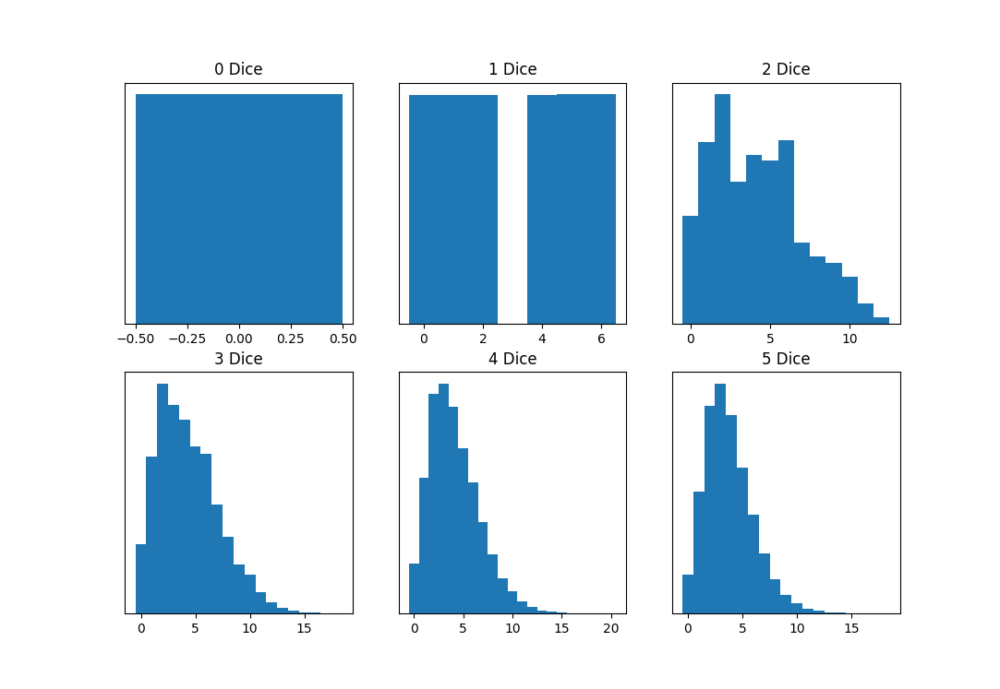

# Threes Solver
Threes is a fairly simple dice game (you can read the rules [here](http://www.dice-play.com/Games/Threes.htm)). But, when playing with my family, I realized that calculating the optimal action on a given turn would be a very interesting problem to consider. 

## The Process
Because of the ability to select a non-predetermined number of dice, there is a very large number of potential outcomes. I found that modeling this large outcome space with conditional probabilities would be very complex, so a Monte Carlo approach made more sense. Rather than assigning an exact probability to each event, I could take a large number of samples from predefinied sampling distributions and receive an answer that approaches the ground truth. But, how would these distributions be built?
When I first began on this project, I used a very naive strategy of for each trial backtracking through every potential action, i.e. simulating each dice roll and keeping every combination of dice at every tier. This led to very large and impractical runtimes. \
\
One consideration that allowed for a large speedup in runtime is the observation that there are some decisions for which dice to keep that simply make no sense. It really only makes sense to keep the dice with the lowest point values. So, now the program could sort the dice by point value and at each tier, the program only had to consider at most 5 combinations of dice to keep (the die with the lowest point value, the 2 dice with the lowest point values, etc.).
\
\
Additionally, when using the naive method, I noticed that the distribution for points *added* for each different selection of number of dice to keep was very consistent. So, there must be a way to be able to build these distributions from the bottom up, allowing for simpler sampling than the current inefficient method of simulating from the top down. Using this paradigm, it is very simple to construct a sampling distribution for 0 dice: if 0 dice are rolled, then 0 points will be added 100% of the time. Similarly, it is also simple to construct a sampling distribution for 1 die: point values corresponding to the die's faces are drawn from a uniform distribution. Now, in the multiple dice case, for each trial, we roll all dice. Consider keeping all of the dice, then consider keeping all of the dice but 1 and sample from the 1 die sampling distribution, taking the minimum of the two possibilities. This strategy is not perfect, as all of this information is not available to the player at the time of their turn, but when repeated over many trials it appears to generate a good approximation of optimal play. We can continue building up sampling distributions using this strategy until we have reached the desired maximum number of dice (in our case 5). Pictured below are the resulting 6 points added distributions:

Now, using these distributions, it is easy to run several simulation trials. Taking in the player's current dice roll and current saved points, the score to beat, and the number of players left, the program iterates through the different possibilities of dice to keep. It samples from the distribution corresponding to the dice remaining, determines if the new sample total points beats the high score, and if so, samples the number of points the other players. If the current player's sample score is lower than the other players' sampled scores, this action resulted in a win for this particular sample. Repeated over several samples for each possibility of dice to keep, we can determine which action one in the highest number of samples and present that action to the player as the best in order for the player to win the game.
